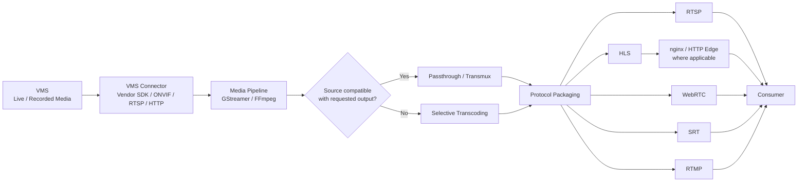
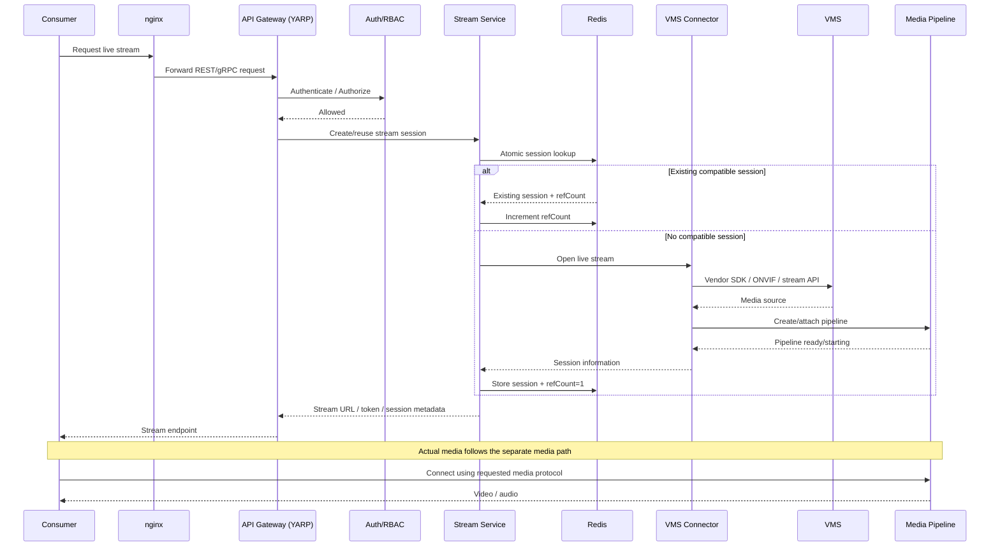
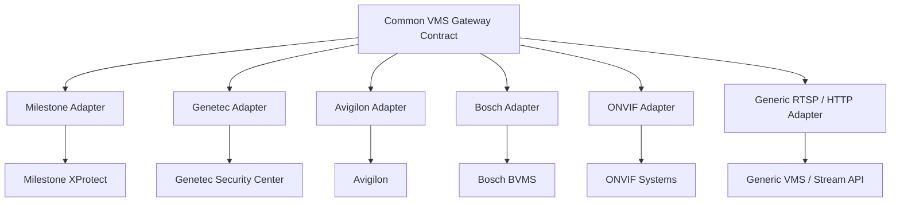
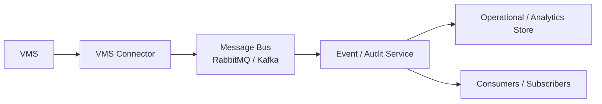

# Video Gateway — Development Partner Response

**Document Type:** Technical Response / Architecture Proposal  
**Version:** 1.0  
**Status:** Submission Draft  
**Date:** August 2026

---

## 1. Executive Response

We understand the proposed Video Gateway as a vendor-neutral integration and media-delivery platform that sits between consumers and existing Video Management Systems (VMS).

The VMS remains the source of truth for cameras, recordings, PTZ capabilities and VMS-generated events. The gateway provides a consistent API and streaming interface while isolating vendor-specific SDKs and protocols behind a common connector layer.

The most important architectural concern is separating **control/API communication from the actual video data path**. API requests establish, authorize and manage streaming sessions; the media plane carries the video itself. This avoids pushing high-bandwidth, long-running media through normal API services or an asynchronous message broker.

The proposed architecture therefore has three logical paths:

1. **Edge / Control Path:** Consumer → nginx → API Gateway (YARP) → application services → VMS connector.
2. **Media Path:** VMS → VMS connector → media pipeline (GStreamer/FFmpeg) → RTSP/HLS/WebRTC/SRT/RTMP → consumer.
3. **Event Path:** VMS → VMS connector → message bus → event/audit processing.

The first implementation phase should be a focused POC using one VMS, one representative camera set, live streaming, at least one output protocol, and passthrough before transcoding. This directly validates the highest-risk technical assumptions before the full product is implemented.

---

# 2. Our Understanding of the Required Solution

The gateway is expected to:

- Integrate with multiple VMS families without connecting directly to cameras.
- Treat the VMS as the source of truth.
- Provide a unified camera/source inventory.
- Deliver live video.
- Provide recorded playback and clip/export capabilities.
- Support PTZ, presets, tours, focus and iris where exposed by the VMS.
- Receive motion, alarm, tamper and analytics events.
- Provide a substantial administration surface.
- Support multiple VMS families and generic/ONVIF-compatible environments.
- Deliver RTSP, HLS, WebRTC, SRT and RTMP outputs.
- Prefer passthrough/repackaging when the source is already compatible.
- Transcode only when required.
- Support authentication, RBAC, multi-tenancy, auditing and operational observability.
- Run as deployable containers and support production scaling.

The architecture is designed around these requirements while keeping vendor-specific integration contained in adapters.

---

# 3. Proposed Architecture

## 3.1 Overall Architecture

The architecture deliberately separates the **control plane** and **media plane**.

```mermaid
flowchart TB
    C[Consumers<br/>Web / Mobile / Integrations]

    NG[nginx<br/>Edge Reverse Proxy / Ingress<br/>TLS / Edge Routing]

    GW[API Gateway<br/>REST + gRPC<br/>Implementation: YARP]

    AUTH[Auth / RBAC]
    APP[Application Services<br/>Device / Stream / Recording / Administration]
    CONN[VMS Connector Layer]

    VMS[VMS Platforms<br/>Milestone / Genetec / Avigilon / Bosch / ONVIF / Generic]

    MP[Media Pipeline<br/>GStreamer / FFmpeg]

    OUT[Media Outputs<br/>RTSP / HLS / WebRTC / SRT / RTMP]

    BUS[Message Bus<br/>Asynchronous Events]
    EVT[Event / Audit Service]

    C --> NG
    NG --> GW
    GW --> AUTH
    GW --> APP
    APP --> CONN
    CONN --> VMS

    CONN --> MP
    MP --> OUT
    OUT --> C

    CONN --> BUS
    BUS --> EVT
```



### Architectural boundary

The diagram intentionally shows nginx and YARP on the **control/API side** and the media engine on the **media side**.

The API Gateway is not intended to carry the continuous video stream.

---

# 4. Edge and Control Communication

## 4.1 nginx

nginx is the infrastructure-level **edge reverse proxy / ingress**.

Its responsibilities can include:

- TLS termination
- External ingress
- HTTP routing
- Connection handling
- Edge-level load balancing
- Infrastructure-level policies

nginx is **not the media engine**. It does not perform video decoding, encoding or transcoding.

For HTTP-based media such as HLS, nginx may participate in media delivery/routing where appropriate. The architecture does not assume that standard nginx HTTP reverse-proxy behavior automatically supports every streaming protocol.

---

## 4.2 API Gateway and YARP

The architectural role is:

> **API Gateway — REST + gRPC**

The proposed .NET implementation is:

> **YARP (Yet Another Reverse Proxy)**

This distinction is intentional:

```text
Architectural role:  API Gateway
Implementation:      YARP
```

The API Gateway provides application-level routing and gateway policies for REST/gRPC traffic.

It is separate from nginx:

```text
nginx
  = infrastructure / edge proxy

API Gateway
  = application/API gateway

YARP
  = proposed implementation of the API Gateway
```

This allows the architecture to remain conceptually technology-neutral while still identifying the proposed implementation.

---

# 5. Video / Media Data Path

## 5.1 Media Architecture



### Key principle

> **The Media Pipeline is the media-processing component. nginx is not the media engine.**

The media engine should use passthrough or repackaging whenever possible. Transcoding is introduced only when required by codec, container, profile or protocol constraints.

---

## 5.2 Protocol Considerations

| Output | Intended use | Edge consideration |
|---|---|---|
| RTSP | VMS/NVR/player/integration consumers | Use a protocol-capable media endpoint; do not assume standard HTTP proxying. |
| HLS | Browser/mobile/general HTTP distribution | nginx can participate as an HTTP edge where appropriate. |
| WebRTC | Low-latency browser/interactive viewing | HTTP/signaling may use the edge; real-time media transport is handled separately. |
| SRT | Resilient contribution/transport | Requires protocol-capable media handling; do not assume standard nginx HTTP proxying. |
| RTMP | Legacy integrations/external streaming | Requires appropriate protocol support; do not equate it with normal nginx HTTP proxying. |

The POC should validate the actual protocol behavior against the selected VMS and representative source streams.

---

# 6. Live Stream Request Flow



The control path therefore establishes and authorizes the session, while the media path carries the actual video.

---

# 7. Session Deduplication

One of the important scaling considerations is avoiding unnecessary duplicate upstream VMS sessions.

For identical source/profile requirements:

```text
Consumer A ──┐
Consumer B ──┼──> Gateway session ──> One VMS session
Consumer C ──┘              |
                             └──> Media pipeline / distribution
```

Instead of:

```text
Consumer A ──> VMS session 1
Consumer B ──> VMS session 2
Consumer C ──> VMS session 3
```

Redis is proposed for ephemeral session coordination, including:

- Session registry
- Reference counts
- Short-lived locks
- Session state
- Health information

The exact session key must include all properties that make an upstream session materially different, such as VMS, camera/source and stream profile. Protocol-specific differences should also be included where they require separate pipelines.

The session creation operation must be atomic to prevent concurrent requests from creating duplicate upstream sessions.

---

# 8. VMS Connector Architecture

The connector layer is the main mechanism for supporting multiple VMS families without spreading vendor-specific code throughout the application.



A common connector contract can expose operations such as:

```text
Connect()
HealthCheck()
DiscoverCameras()
GetLiveStream()
GetPlaybackStream()
CreateClip()
PTZ()
GetPresets()
GetTours()
SubscribeEvents()
Disconnect()
```

The exact interface should be finalized after the first VMS SDK is evaluated because vendor capabilities and API semantics differ.

Where vendor SDK runtime or stability characteristics justify it, connectors can be isolated into separate processes/containers to reduce the blast radius of SDK failures.

---

# 9. Media Engine Strategy

GStreamer and FFmpeg are proposed as media-processing technologies rather than as API services.

### GStreamer

A strong candidate for:

- Long-running pipelines
- Live media orchestration
- Dynamic pipeline management
- Protocol integration

### FFmpeg

A strong candidate for:

- Codec conversion
- Media inspection
- Clip/export operations
- Transcoding workloads

The project should not assume that every workload needs both technologies.

Phase 1 should benchmark the actual VMS streams and determine the most appropriate division of responsibility.

Key measurements:

- Stream startup time
- End-to-end latency
- CPU consumption
- Memory consumption
- Transcoding throughput
- Concurrent streams
- Pipeline stability
- Recovery time
- GPU utilization where applicable

---

# 10. Recorded Playback and Clip Export

Recorded video remains owned by the VMS.

The gateway requests playback through the appropriate VMS connector.

```text
Consumer
   |
   v
API Gateway
   |
   v
Auth / RBAC
   |
   v
Recording Service
   |
   v
VMS Connector
   |
   v
VMS Recording
   |
   v
Media Pipeline
   |
   v
Consumer
```

For clip export, the gateway can optionally package the requested recording and store the resulting artifact in object storage.

Gateway-side archival should be treated as a policy-driven capability rather than assuming that the gateway replaces the VMS recording system.

---

# 11. PTZ and Control Operations

PTZ is a control operation and follows the API/control path.

```text
Consumer
   |
   v
nginx
   |
   v
API Gateway
   |
   v
Auth / RBAC
   |
   v
Stream / Device Service
   |
   v
VMS Connector
   |
   v
VMS PTZ API
```

The same connector abstraction should be used for:

- PTZ movement
- Presets
- Tours
- Focus
- Iris

Only capabilities exposed by the underlying VMS should be advertised to the consumer.

---

# 12. Event and Audit Path

Events are asynchronous and should not be placed on the continuous media path.



Examples include:

- Motion
- Alarm
- Tamper
- Analytics events
- VMS health events
- Stream lifecycle events
- PTZ audit events
- Configuration changes

The message bus is therefore an **event/control messaging mechanism**, not a video transport.

---

# 13. Security, RBAC and Multi-Tenancy

Security should be applied before protected VMS or media operations.

The authorization model should support:

- Authentication through OAuth2/OIDC/SSO where required
- Tenant isolation
- Role-based access control
- Per-camera permissions
- PTZ authorization
- Recording permissions
- Protocol restrictions
- Stream/session quotas
- Credential protection and rotation
- TLS
- Audit logging

A request should carry tenant and authorization context through:

```text
Consumer
  ↓
nginx
  ↓
API Gateway
  ↓
Auth / RBAC
  ↓
Application Service
  ↓
VMS Connector
```

A valid identity alone must not imply access to every camera or operation.

---

# 14. Administration and Operations

Administration should be treated as a first-class part of the product.

| Area | Proposed capability |
|---|---|
| VMS / Sources | Registration, credentials, connectivity tests, discovery, health |
| Streams | Active sessions, profiles, subscriber/session visibility, disconnect |
| Recording | Playback, export, archive policy and retention |
| Identity | Users, service accounts, roles, RBAC, SSO |
| Policies | Quotas, protocol restrictions, PTZ permissions |
| Operations | Node/service health, scaling and maintenance |
| Observability | Metrics, structured logs, tracing and alerts |
| Audit | Viewing, PTZ, configuration and evidence-related actions |
| Configuration | TLS, network, backup/restore and configuration management |

The final administration scope should be refined during discovery based on the client's operational requirements.

---

# 15. Phase 1 — Proof of Concept

The first phase should focus on proving the highest-risk technical assumptions rather than implementing the complete product.

## POC Scope

### VMS

- Select one target VMS family.
- Validate its SDK/API and licensing requirements.
- Connect to a representative test environment.

### Cameras

Use approximately 5–10 representative cameras where available, covering realistic codec, resolution, frame-rate and bitrate combinations.

### Live Streaming

Implement:

- VMS connection
- Live stream acquisition
- One mandatory output protocol
- Session creation/reuse
- Consumer playback

### Passthrough

Demonstrate that a compatible source can be delivered without unnecessary transcoding.

### Media Engine

Compare the selected GStreamer/FFmpeg approach using real streams.

### Session Deduplication

Demonstrate that multiple consumers requesting the same compatible source can reuse a single upstream VMS session.

### PTZ

If PTZ is part of the selected VMS/camera setup, demonstrate at least one PTZ operation.

### Events

Demonstrate reception and forwarding of at least one representative VMS event.

### Failure Testing

Validate:

- VMS disconnect/reconnect
- Consumer reconnect
- Media pipeline failure
- Connector restart
- Session cleanup

## POC Measurements

Capture:

- Stream startup time
- End-to-end latency
- CPU
- Memory
- Network bandwidth
- Concurrent sessions
- Upstream VMS session count
- Media pipeline count
- Recovery time
- Transcoding performance

---

# 16. POC Exit Criteria

The POC should demonstrate:

1. Successful integration with the selected VMS.
2. Live stream acquisition.
3. Delivery using at least one required output protocol.
4. Passthrough when source and output are compatible.
5. Controlled transcoding when required.
6. Session deduplication for identical stream requirements.
7. VMS connection recovery.
8. Media pipeline recovery.
9. Basic event handling.
10. Sufficient measurements to establish production sizing.

The remaining VMS families and protocols can then be implemented as contained extensions of the validated architecture.

---

# 17. Key Challenges and Mitigations

| Challenge | Proposed mitigation |
|---|---|
| Multiple VMS SDKs and protocols | Common VMS connector contract and isolated vendor adapters |
| Vendor SDK instability | Process/container isolation where justified |
| Duplicate VMS sessions | Atomic Redis session coordination and reference counting |
| Low-latency WebRTC/SRT | Dedicated media path and early latency benchmarking |
| CPU/GPU pressure from transcoding | Passthrough first; transcode only when required |
| Long-running stateful streams | Explicit session lifecycle, health checks, reconnect and graceful draining |
| Large number of concurrent streams | Independently scalable media workers and admission control |
| Multi-tenant security | Centralized tenant-aware RBAC and per-source authorization |
| Audit/compliance | Structured audit events plus immutable storage where required |
| Adding future VMS families | Adapter boundary prevents vendor code from leaking into core services |

---

# 18. Production Architecture Principles

The production design should follow these principles:

### Independent scaling

Control services and media workers should scale independently.

### Resource protection

Use quotas and admission control for:

- Concurrent streams
- Per-tenant usage
- VMS session limits
- Transcoding capacity

### Explicit stream lifecycle

Streams should have states such as:

```text
Requested
   ↓
Authorizing
   ↓
Creating / Reusing
   ↓
Starting
   ↓
Running
   ↓
Reconnecting
   ↓
Draining
   ↓
Stopped
```

### Graceful release

When the final consumer disconnects:

```text
refCount--
    |
    +-- still > 0 --> keep upstream session
    |
    +-- reaches 0 --> idle grace period
                         |
                         +-- new consumer --> reuse
                         |
                         +-- no consumer --> close
```

This avoids unnecessary VMS session churn.

---

# 19. Technology Choices and Validation

The following are **proposed technologies, not final contractual commitments**:

| Area | Proposed approach |
|---|---|
| Edge | nginx |
| API Gateway | YARP |
| Backend services | .NET / ASP.NET Core |
| Media | GStreamer / FFmpeg |
| Session coordination | Redis |
| Messaging | RabbitMQ or Kafka |
| Durable transactional data | Relational database |
| High-volume event analytics | Analytics-oriented store such as ClickHouse where justified |
| Clip/evidence storage | S3-compatible object storage where required |
| Deployment | Containers; target orchestration environment to be confirmed |

Phase 1 should validate these choices against the client's existing infrastructure, VMS SDK constraints and actual workload.

---

# 20. Questions for the Client

The following questions should be confirmed before production sizing and detailed design:

1. Which VMS family and exact version should be the first POC target?
2. Are the required VMS SDKs and licenses available?
3. What are the expected camera counts?
4. What are typical and peak camera resolutions, codecs, frame rates and bitrates?
5. What is the expected number of concurrent viewers?
6. How frequently will multiple users view the same camera simultaneously?
7. Is sub-500 ms WebRTC latency a contractual requirement?
8. Which output protocols are mandatory for Phase 1 and Phase 2?
9. Is gateway-side recording required in the first production release?
10. What recording retention and clip-duration requirements exist?
11. Is immutable/WORM evidence storage mandatory?
12. Which identity provider/SSO platform should be integrated?
13. What tenant-isolation requirements apply?
14. What deployment environment is expected: on-premises, cloud or hybrid?
15. Are GPU resources available or expected for transcoding?
16. What network/firewall restrictions exist between the gateway and VMS systems?
17. What VMS-side licensing or concurrent-session limits exist?
18. Is RabbitMQ or Kafka already standardized in the target environment?
19. Which observability platform is already available?
20. Which VMS integrations are mandatory for the first production release?

---

# 21. Team and Relevant Experience

**This section must be completed with the actual proposed team information before submission. The source brief requires these details, and they should not be replaced with assumptions.**

| Requirement | Response |
|---|---|
| Engineering capacity | **[Insert actual number of engineers and seniority mix]** |
| Dedicated/shared allocation | **[Insert actual allocation]** |
| Technical lead | **[Insert actual lead and relevant experience]** |
| Streaming experience | **[Insert genuine RTSP/HLS/WebRTC/SRT/RTMP production experience]** |
| VMS SDK experience | **[Insert genuine Milestone/Genetec/Avigilon/Bosch/ONVIF experience]** |
| FFmpeg/GStreamer experience | **[Insert genuine production experience]** |
| Multi-tenant experience | **[Insert genuine production examples]** |
| Relevant scale | **[Insert actual concurrent-stream/system scale]** |
| References | **[Insert actual customer/project references if permitted]** |

Do not claim experience with a VMS SDK, media framework or production scale unless it is genuinely available within the proposed team.

---

# 22. Why This Approach Reduces Risk

The proposed approach intentionally avoids committing the project to a complete production implementation before the highest-risk assumptions are proven.

The first POC validates:

```text
VMS SDK
   +
Live stream acquisition
   +
Media engine
   +
One output protocol
   +
Passthrough
   +
Session deduplication
   +
Basic failure recovery
```

Once those assumptions are proven, additional VMS families and protocols can be implemented behind the same connector/media boundaries.

This reduces the risk of discovering late in development that:

- a vendor SDK behaves differently than expected,
- the VMS imposes unexpected session/licensing limits,
- a codec/protocol requires transcoding,
- WebRTC latency is outside the target,
- a media engine cannot meet the required concurrency,
- or a vendor integration requires process isolation.

---

# 23. Summary

The proposed Video Gateway architecture is based on a clear separation of responsibilities:

```text
CONTROL / API
Consumer
   ↓
nginx
Edge Reverse Proxy / Ingress
   ↓
API Gateway
REST + gRPC
Implementation: YARP
   ↓
Auth / RBAC
   ↓
Application Services
   ↓
VMS Connector
   ↓
VMS


MEDIA / VIDEO
VMS
   ↓
VMS Connector
   ↓
Media Pipeline
GStreamer / FFmpeg
   ↓
RTSP / HLS / WebRTC / SRT / RTMP
   ↓
Consumer


EVENTS
VMS
   ↓
VMS Connector
   ↓
Message Bus
   ↓
Event / Audit Service
```

The core design principles are:

- The VMS remains the source of truth.
- Cameras are not connected to directly by the gateway.
- VMS-specific SDK logic is isolated behind adapters.
- nginx is the infrastructure edge component.
- YARP implements the application API Gateway role.
- The Media Pipeline is responsible for media processing.
- Continuous video does not pass through normal API services.
- Continuous video does not pass through the message bus.
- Passthrough is preferred over unnecessary transcoding.
- Redis can coordinate ephemeral stream/session state and prevent duplicate VMS sessions.
- Security, RBAC and tenant isolation are enforced before protected operations.
- Events and audit are asynchronous.
- Phase 1 validates the highest-risk assumptions before full-scale implementation.

The architecture remains intentionally technology-flexible where the project brief does not mandate a specific implementation. Final technology selections and production sizing should be confirmed through the Phase 1 POC and the client's existing infrastructure and VMS environment.

---

## Submission Checklist

Before sending this response, replace all bracketed placeholders in **Section 21**, verify the actual team experience and references, and confirm that the selected VMS/protocol assumptions match the client's expected Phase 1 environment.
