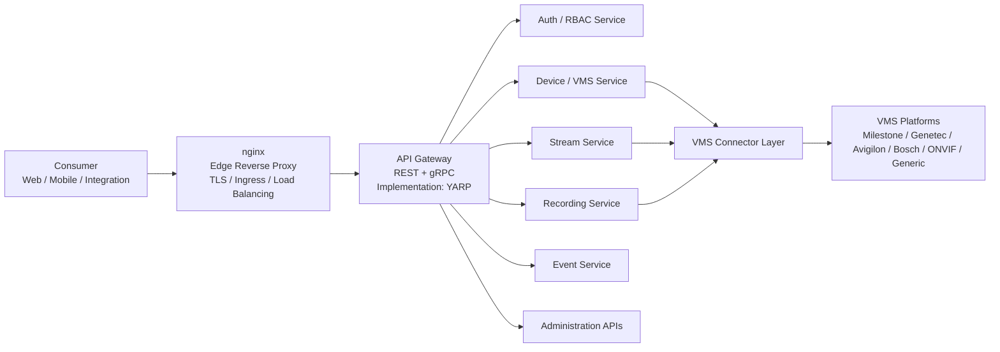
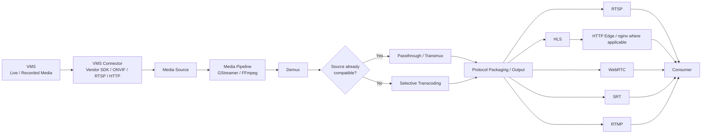
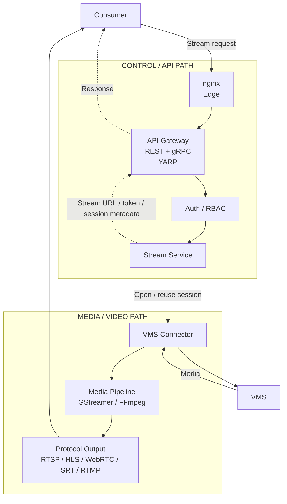
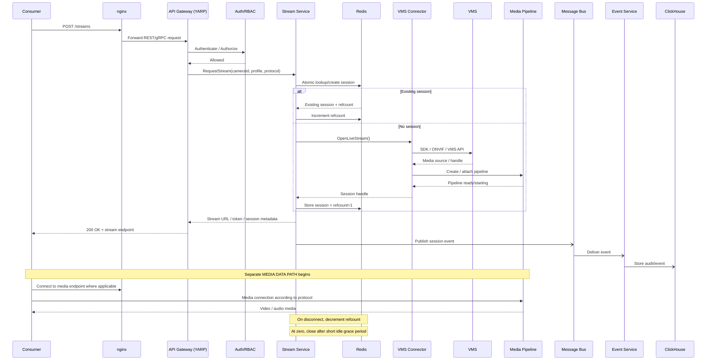
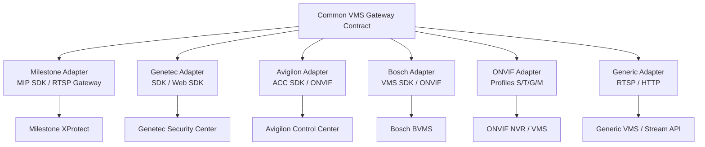
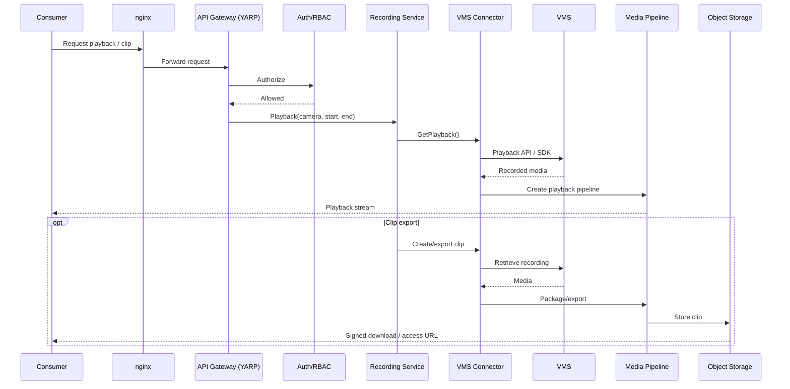
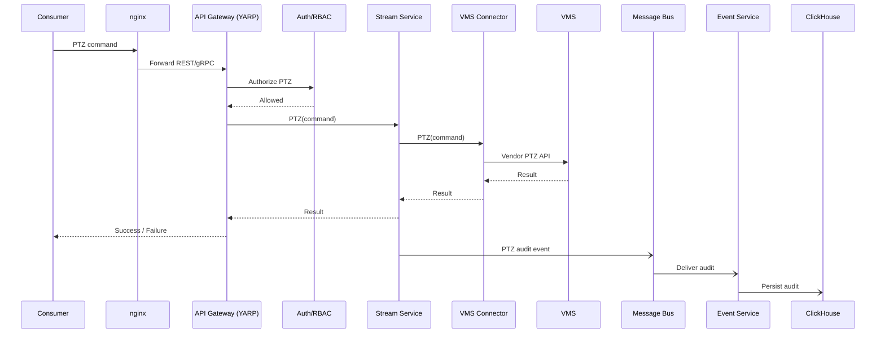
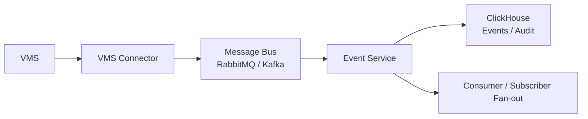
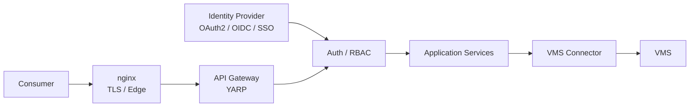
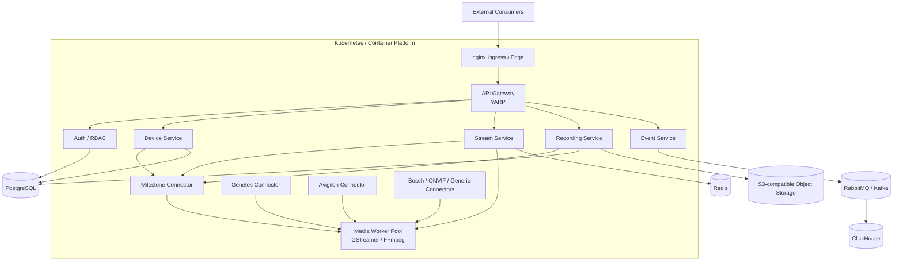

# Video Gateway — High-Level Design (HLD)

**Document Type:** Technical Architecture / Interview Response  
**Status:** Submission Draft  
**Version:** 2.0  
**Date:** August 2026

---

## 1. Purpose

This document presents a production-oriented high-level design for the Video Gateway described in the project brief.

The gateway is a back-end product that connects to third-party Video Management Systems (VMS), obtains live and recorded video, camera-control capabilities, and events, and exposes them through a common gateway interface and modern streaming protocols.

The gateway is **not a replacement for a VMS**. The VMS remains the source of truth for cameras, recordings and operator workflows. The gateway provides the integration and media-delivery layer between VMS platforms and consumers.

The architecture is deliberately divided into:

1. **Edge / Control Communication Path** — HTTP/REST/gRPC requests, authentication, authorization, administration and control operations.
2. **Video / Media Data Path** — actual video acquisition, media processing and protocol delivery.
3. **Asynchronous Event Path** — events and audit messages through a message bus.

This separation is important because video data has very different performance and lifecycle characteristics from normal API traffic.

---

# 2. Scope and Requirements Alignment

The project brief requires the gateway to:

- Connect to multiple VMS systems through vendor SDKs, ONVIF or generic stream APIs.
- Keep the VMS as the source of truth and never connect directly to cameras.
- Discover cameras and provide a unified inventory.
- Deliver live video.
- Proxy recorded playback and support time-range requests, seeking and clip generation.
- Optionally archive selected streams on the gateway.
- Pass through PTZ, presets, tours, focus and iris controls through the VMS.
- Subscribe to motion, alarm, tamper and analytics events.
- Provide a substantial administration surface.
- Support Milestone XProtect, Genetec Security Center, Avigilon, Bosch BVMS, ONVIF-compatible systems and generic RTSP/HTTP systems.
- Produce RTSP, HLS, WebRTC, SRT and RTMP outputs.
- Avoid transcoding when the source is already compatible.
- Provide multi-tenant access control, auditing, observability and production operations.

The proposed architecture addresses these requirements while keeping VMS-specific SDK dependencies isolated behind adapters.

---

# 3. Architectural Principles

## 3.1 VMS remains the source of truth

The gateway does not replace the VMS and does not directly manage cameras.

```text
                    +-----------------------+
                    |         VMS           |
                    | Cameras               |
                    | Recordings            |
                    | PTZ / control         |
                    | VMS events            |
                    +-----------+-----------+
                                ^
                                |
                         Gateway integration
                                |
                    +-----------+-----------+
                    |    Video Gateway      |
                    +-----------------------+
```

The gateway reads and controls capabilities exposed by the VMS.

---

## 3.2 Control plane and media plane are separate

Normal API/control traffic and video bytes must not be treated as the same workload.

The control plane handles:

- Authentication
- Authorization
- Camera discovery
- VMS management
- Stream session creation
- Recording requests
- PTZ commands
- Configuration
- Administration
- Audit/event coordination

The media plane handles:

- Media acquisition
- Demuxing
- Transmuxing/repackaging
- Selective transcoding
- Segmentation
- Protocol-specific media output
- Long-running media sessions

The message bus is not part of the media data path.

---

## 3.3 nginx is an edge component, not the media engine

nginx is used as the **edge reverse proxy / ingress component**.

Its responsibilities may include:

- TLS termination
- External ingress
- HTTP routing
- Connection handling
- Edge-level load balancing
- Infrastructure-level policies

nginx is **not responsible for**:

- Video decoding
- Video encoding
- Transcoding
- Demuxing
- Media pipeline orchestration
- Codec conversion

Normal nginx reverse-proxy behavior should not be assumed to mean that every streaming protocol is proxied through nginx.

For HTTP-based media delivery such as HLS, nginx may participate in the delivery/routing path when appropriate.

For RTSP, SRT, RTMP or WebRTC media transport, the deployment must explicitly support the required protocol and connection model. The media engine remains responsible for media processing.

---

## 3.4 API Gateway is an architectural role; YARP is the implementation

The architecture uses an **API Gateway** as the application-level gateway.

Proposed implementation:

> **API Gateway — REST + gRPC — implementation: YARP**

YARP (Yet Another Reverse Proxy) is a .NET reverse-proxy toolkit that can implement application/API gateway responsibilities.

The distinction is:

```text
Architectural role:     API Gateway
Implementation:         YARP
```

This is intentionally different from nginx:

```text
nginx
  = infrastructure / edge proxy

API Gateway (YARP)
  = application/API routing layer
```

The architecture does not require YARP to process video bytes.

---

# 4. High-Level Architecture

The architecture is best represented with separate diagrams rather than placing nginx, YARP and the media engine into one ambiguous flow.

---

# 5. Diagram 1 — Edge and Control Communication Path

## Purpose

This diagram represents HTTP/REST/gRPC and control communication.

It does **not** represent the actual video-byte path.



### Diagram interpretation

1. Consumer sends an API/control request.
2. nginx receives the external connection.
3. nginx performs edge-level responsibilities and forwards the API request.
4. The API Gateway provides application-level routing.
5. YARP is the proposed implementation of the API Gateway.
6. Authentication and authorization are applied before protected operations proceed.
7. Application services perform business operations.
8. VMS connectors translate gateway contracts into vendor-specific VMS operations.
9. The VMS remains the source of truth.

### Important boundary

**No video stream should be assumed to flow through the API Gateway.**

The API Gateway returns metadata such as:

- stream URL
- stream token
- session ID
- playback handle
- operation result

The actual media transfer follows the separate media path.

---

# 6. Diagram 2 — Video / Media Data Path

## Purpose

This diagram represents the actual video path.



### Critical architecture statement

> **The Media Pipeline is the media-processing component. nginx is not the media engine.**

The gateway should use passthrough or repackaging whenever the source is compatible with the requested output. Transcoding should only occur when required by codec, container, profile or protocol constraints.

---

# 7. Protocol-Specific Edge Considerations

The output protocols have different connection and delivery characteristics.

| Protocol | Typical purpose | nginx position |
|---|---|---|
| RTSP | NVRs, players, integrations | Do not assume normal HTTP reverse proxying; use a protocol-capable media endpoint. |
| HLS | Browser/mobile/CDN distribution | nginx can participate as HTTP edge/proxy/static segment delivery where appropriate. |
| WebRTC | Low-latency interactive monitoring | nginx can handle HTTP/signaling edge traffic where applicable; real-time media transport is handled separately. |
| SRT | Long-distance resilient contribution | Use a protocol-capable media endpoint; do not assume standard nginx HTTP proxy behavior. |
| RTMP | Legacy ingest/external CDN | Requires appropriate protocol support; do not represent generic nginx HTTP proxying as RTMP media handling. |

This prevents the architecture diagram from making the incorrect implication that nginx automatically proxies every media protocol.

---

# 8. Diagram 3 — Relationship Between Control Plane and Media Plane

The two paths are connected by **session/control metadata**, not by sending the video through the control services.



### Key point

The control path establishes and authorizes the media session.

The media path then carries the actual video.

---

# 9. Diagram 4 — Live Stream Request Sequence

This sequence shows the relationship between API/control and media delivery.



---

# 10. Live Stream Processing

## 10.1 Request phase

The consumer requests a stream using the API.

Example:

```http
POST /api/v1/streams
Content-Type: application/json

{
  "cameraId": "camera-123",
  "protocol": "hls",
  "profile": "main"
}
```

The API Gateway authenticates and routes the request to the Stream Service.

## 10.2 Authorization

Authorization occurs before opening or reusing a VMS session.

The policy decision may consider:

- Tenant
- User/service identity
- Camera/source
- Requested protocol
- Requested stream profile
- Recording permissions
- PTZ permissions where relevant
- Tenant quotas
- VMS/session limits

A denied request must not cause downstream VMS or media work.

## 10.3 Session deduplication

A deduplication key should identify the upstream media session.

Example:

```text
vmsId:cameraId:profile
```

The protocol may also need to participate in the key when different protocol requirements cause genuinely different upstream media pipelines.

Redis stores ephemeral session state.

Example:

```text
stream:session:vms01:camera123:main
    sessionId = abc123
    upstreamHandle = xyz789
    refCount = 7
    status = Running
    lastActivity = ...
```

The session creation operation must be atomic.

The goal is to prevent multiple consumers from creating duplicate upstream VMS sessions when the same source/profile can be shared.

---

# 11. Redis Session Coordination

Redis is used for high-churn ephemeral state rather than durable business data.

Responsibilities:

- Session registry
- Reference counts
- Session locks
- Short-lived state
- Session health information
- Coordination

Redis should not become the authoritative database for:

- Users
- Tenants
- VMS configuration
- Camera inventory
- Audit history

Those belong in durable storage.

---

# 12. Media Pipeline

The Media Pipeline is responsible for media processing.

A conceptual pipeline is:

```text
Media Source
    |
    v
Demux
    |
    v
Codec / Container Inspection
    |
    +---- Compatible ----> Passthrough / Transmux
    |
    +---- Not compatible -> Selective Transcoding
                                  |
                                  v
                         Protocol Packaging
                                  |
                                  v
                       Protocol-specific output
```

## Proposed media technologies

- GStreamer
- FFmpeg

These should remain native media technologies and be orchestrated by the .NET control/services layer rather than attempting to recreate codec and protocol functionality inside .NET.

The final choice of which engine handles which workload should be validated during the POC.

---

# 13. Media Engine Decision

The architecture should not claim that every media operation must use both GStreamer and FFmpeg.

### GStreamer

Strong candidate for:

- Long-running pipelines
- Pipeline orchestration
- Live media processing
- Protocol integration
- Dynamic pipeline management

### FFmpeg

Strong candidate for:

- Codec conversion
- Transcoding utilities
- Media inspection
- Clip/export operations
- Workloads where FFmpeg's codec/protocol support is advantageous

### POC decision

Phase 1 should benchmark the actual target VMS streams and determine:

- CPU consumption
- Memory usage
- Latency
- Startup time
- Stream stability
- Transcoding throughput
- GPU utilization if GPU acceleration is used

---

# 14. VMS Connector Layer

The connector layer isolates VMS-specific implementation.



Each adapter should implement common operations such as:

```text
Connect()
HealthCheck()
DiscoverCameras()
GetLiveStream()
GetPlaybackStream()
CreateClip()
PTZ()
GetPresets()
GetTours()
SubscribeEvents()
Disconnect()
```

The exact interface should be finalized after the first VMS SDK is tested because vendor capabilities differ.

---

# 15. Connector Process Isolation

A vendor SDK can have different runtime, licensing or stability characteristics.

Therefore, the architecture allows vendor connectors to run as separate processes/containers.

```text
Gateway
   |
   +---- Milestone Connector Process
   |
   +---- Genetec Connector Process
   |
   +---- Avigilon Connector Process
   |
   +---- Bosch Connector Process
   |
   +---- Generic/ONVIF Connector Process
```

Benefits:

- SDK crash isolation
- Independent scaling
- Vendor-specific dependency isolation
- Easier upgrades
- Reduced blast radius
- Independent operational monitoring

The POC should determine whether each connector must be isolated as a separate process or whether some adapters can safely run in a shared service.

---

# 16. Recorded Video Flow

Recorded video remains owned by the VMS.



The gateway is not intended to become a replacement recording system.

Gateway-side archival is optional and should be controlled by explicit policy.

---

# 17. PTZ Control Flow

PTZ is a control operation, not a media operation.



The synchronous PTZ command must not wait for the message bus.

The command result is returned immediately, while the audit record is asynchronous.

---

# 18. Event Flow

VMS events are asynchronous.



Examples:

- Motion
- Alarm
- Tampering
- Analytics events
- VMS health events
- Session lifecycle events
- PTZ audit events
- Configuration changes

The message bus carries event/control messages, not continuous media.

---

# 19. Data Architecture

## 19.1 PostgreSQL

Use PostgreSQL for durable transactional data:

- Tenants
- Users/service accounts where applicable
- Roles
- VMS registry
- Camera/source inventory
- Policies
- Stream profiles
- Recording/archive configuration
- Configuration history where transactional consistency is needed

## 19.2 Redis

Use Redis for ephemeral high-churn runtime state:

- Stream sessions
- Reference counts
- Locks
- Session health
- Short-lived tokens/state
- Coordination

## 19.3 ClickHouse

Use ClickHouse for high-volume append-only analytical workloads:

- VMS events
- Operational audit events
- PTZ logs
- Stream/session lifecycle events
- Time-range operational analytics

For authoritative compliance evidence requiring tamper-evident or WORM retention, immutable object storage should be considered in addition to ClickHouse.

## 19.4 Object Storage

S3-compatible object storage can be used for:

- Exported clips
- Optional gateway-side archive
- Evidence packages
- Long-term media retention where required

---

# 20. Administration Surface

The administration capability is a first-class part of the product.

### VMS and Source Management

- Register VMS
- Manage credentials
- Test connectivity
- Discover cameras
- Enable/disable sources
- Monitor per-VMS health

### Stream and Session Management

- Active streams
- Session inspection
- Subscriber inspection
- Force disconnect
- Transcoding profiles
- Output endpoints

### Recording and Archive

- Playback configuration
- Archive policy
- Retention
- Clip/export jobs
- Storage backends

### Identity and Access

- Users
- Service accounts
- Roles
- RBAC
- OAuth/OIDC/SSO
- API keys where required
- Per-camera permissions
- Tenant isolation
- Credential rotation

### Policy and Quotas

- VMS session limits
- Tenant bandwidth limits
- Stream caps
- PTZ permissions
- Recording policies
- Protocol allow-lists
- Maintenance windows

### Cluster and Runtime

- Node inventory
- Service scaling
- Feature flags
- Rolling upgrades
- Licensing tracking

### Observability

- Metrics
- Structured logs
- Distributed tracing
- Alerts
- Operational dashboards

### Audit and Compliance

- Who watched what
- PTZ command logs
- Configuration changes
- Evidence export
- Tamper-evident audit handling

### Configuration

- Network
- TLS
- Backup/restore
- Infrastructure-as-code export
- Webhooks

---

# 21. Security Architecture



Security controls:

- OAuth2/OIDC
- SSO where required
- RBAC
- Tenant isolation
- Per-camera authorization
- Operation-level authorization
- PTZ authorization
- TLS
- Secret management
- Credential rotation
- Protocol allow-lists
- Tenant quotas
- Audit logging
- Tamper-evident evidence handling where required

---

# 22. Multi-Tenancy

Every protected operation should be evaluated in tenant context.

Example authorization model:

```text
Tenant
  |
  +-- Users / Service Accounts
  |
  +-- Roles
  |
  +-- VMS Instances
  |
  +-- Cameras
  |
  +-- Stream Policies
  |
  +-- PTZ Permissions
  |
  +-- Recording Policies
  |
  +-- Quotas
```

The tenant context must flow through:

```text
Consumer
  ↓
API Gateway
  ↓
Auth/RBAC
  ↓
Service
  ↓
VMS Connector
```

No service should assume that a valid authentication token automatically means access to every camera.

---

# 23. Observability

The platform should expose metrics, logs and traces across both control and media orchestration.

Important metrics include:

- API request latency
- API error rates
- Active VMS sessions
- Active consumer sessions
- Consumers per camera
- Session deduplication ratio
- VMS connection failures
- VMS reconnects
- Media pipeline startup failures
- Media pipeline restarts
- Dropped frames
- WebRTC latency
- Transcoding CPU/GPU usage
- Per-tenant bandwidth
- Redis health
- Redis lock contention
- Message-bus lag
- Event processing failures
- Authentication failures
- Authorization failures

Long-running streams require special attention to:

- Heartbeats
- Session health
- Reconnection
- Backoff
- Resource cleanup
- Graceful draining
- Deployment behavior

---

# 24. Failure Handling

| Failure | Expected behavior |
|---|---|
| VMS unavailable | Connector marks source unhealthy and reconnects using bounded exponential backoff. |
| VMS session drops | Session enters reconnecting/failed state and consumer receives controlled failure/reconnect behavior. |
| Media worker crashes | Supervisor/orchestrator restarts worker and recreates affected pipelines where safe. |
| Redis unavailable | New session creation should fail safely rather than risk uncontrolled duplicate VMS sessions. Existing sessions require explicitly defined degraded behavior. |
| Message bus unavailable | Synchronous stream/PTZ operations should not depend on bus availability. Events/audit are retried. |
| PostgreSQL unavailable | New configuration changes may fail, while existing media sessions should continue where runtime state permits. |
| Node maintenance | Drain new assignments, preserve or gracefully reconnect long-running sessions, then terminate node. |
| Connector crash | Isolate the affected VMS vendor and restart only the connector where possible. |

---

# 25. Stream Lifecycle

A stream should be represented as an explicit state machine.

```text
Requested
   |
   v
Authorizing
   |
   v
Creating / Reusing
   |
   v
Starting
   |
   +------> Failed
   |
   v
Running
   |
   +------> Reconnecting
   |             |
   |             v
   |          Running
   |
   v
Draining
   |
   v
Stopped
```

This is preferable to relying only on a boolean `active` flag.

---

# 26. Session Release and Grace Period

When a consumer disconnects:

```text
Consumer disconnect
       |
       v
Stream Service
       |
       v
Redis refcount--
       |
       +---- refcount > 0 ----> keep session
       |
       +---- refcount = 0
                    |
                    v
              idle grace period
                    |
                    +---- new consumer arrives --> reuse
                    |
                    +---- no consumer ---------> close VMS session
```

The grace period prevents repeated open/close operations when consumers connect and disconnect rapidly.

---

# 27. Scaling Model

The system can scale different workloads independently.

```text
                 Load Balancer
                       |
        +--------------+--------------+
        |              |              |
   API Gateway     API Gateway    API Gateway
        |              |              |
        +--------------+--------------+
                       |
              Control Services
                       |
             +---------+---------+
             |                   |
        Connector Pool      Media Workers
             |                   |
        VMS connections     Media pipelines
```

Media workers should be scaled according to:

- Concurrent streams
- Bitrate
- Codec
- Transcoding requirements
- CPU/GPU capacity
- Protocol
- Latency requirements

Control services should be scaled according to:

- API request rate
- Concurrent operations
- Administration workload
- Event processing load

These workloads should not be forced to scale together.

---

# 28. Deployment Architecture

A production deployment can be containerized.



The exact Kubernetes topology should be determined after sizing and POC results.

---

# 29. Phase 1 — Discovery and Proof of Concept

The first phase should validate the highest-risk technical assumptions.

## POC scope

### VMS

Use one VMS family as the first target.

Preferably select the first production target agreed with the client.

### Cameras

Use approximately 5–10 representative cameras covering:

- Different codecs
- Different resolutions
- Different frame rates
- Typical and high bitrate scenarios
- At least one PTZ camera if PTZ is important

### Outputs

Validate at least:

- RTSP
- One browser-oriented output
- WebRTC if low latency is a primary requirement

### Media behavior

Validate:

- Passthrough
- Repackaging
- One controlled transcoding scenario

### Session deduplication

Test multiple consumers requesting the same camera and verify that only one upstream VMS session is created where the profile/source requirements are identical.

### Failure tests

Test:

- VMS disconnect
- VMS reconnect
- Media worker crash
- Consumer reconnect
- Redis interruption
- Connector restart
- Graceful deployment drain

### Measurements

Record:

- Stream startup time
- End-to-end latency
- CPU
- Memory
- Bandwidth
- Concurrent sessions
- Pipeline count
- Transcoding throughput
- Recovery time

---

# 30. POC Exit Criteria

The POC should be considered successful when:

1. A live stream can be acquired from the selected VMS.
2. The stream can be delivered using the selected output protocol.
3. Passthrough is used when compatible.
4. Transcoding occurs only when necessary.
5. Multiple consumers can share a single upstream VMS session.
6. PTZ works through the connector abstraction.
7. Events can be received and published.
8. VMS failures are detected and handled.
9. Media worker failures are detected and recovered.
10. Measured results are sufficient to size the production architecture.
11. The GStreamer/FFmpeg division of responsibility is validated.

---

# 31. Production Phases

## Phase 1 — Discovery and POC

- One VMS
- Live stream
- Media engine validation
- Protocol validation
- Session deduplication
- PTZ
- Events
- Failure testing
- Initial sizing

## Phase 2 — Core Build

- Primary VMS integrations
- Main output protocols
- Identity/RBAC
- Stream management
- Recording/playback
- Events
- Essential administration
- Observability

## Phase 3 — Hardening and Expansion

- Additional VMS families
- Complete administration surface
- HA
- Scaling
- Compliance
- Security hardening
- Performance optimization
- Production operations

This phased approach aligns the technical investment with the highest-risk assumptions.

---

# 32. Key Architecture Trade-offs

| Decision | Alternative | Reason |
|---|---|---|
| Separate control and media planes | Send video through API services | Prevents unnecessary bandwidth amplification and latency. |
| nginx at edge | Make nginx the media engine | nginx is appropriate as edge infrastructure, not codec/media processing. |
| API Gateway role implemented with YARP | Put all routing directly in services | Centralizes application API routing and gateway policies. |
| Media not sent through message bus | Use RabbitMQ/Kafka for video | Brokers are not intended for continuous high-throughput media transport. |
| Redis for session state | Store session state in PostgreSQL | Session state is high-churn and ephemeral. |
| Connector abstraction | Spread vendor SDK logic through services | Isolates vendor complexity. |
| Optional connector process isolation | Run every SDK in the same process | Reduces SDK crash blast radius. |
| Transcode only when required | Always transcode | Reduces CPU/GPU cost, latency and quality degradation. |
| Logical service boundaries with flexible deployment | Force many microservices immediately | Avoids excessive operational complexity in v1 while preserving future scaling. |
| ClickHouse for events/audit analytics | Put all events in transactional DB | Better fit for high-volume append-only/time-range analytics. |
| Object storage for authoritative immutable evidence where required | Treat analytical DB as the only archive | Better fit for WORM/long-term evidence requirements. |

---

# 33. Risks and Mitigations

| Risk | Mitigation |
|---|---|
| Vendor SDK differences | Adapter abstraction and early SDK validation. |
| Vendor SDK instability | Process/container isolation where required. |
| SDK licensing | Validate licenses during discovery before implementation commitment. |
| Media complexity | Early GStreamer/FFmpeg POC and benchmarking. |
| Duplicate VMS sessions | Atomic Redis session creation and reference counting. |
| WebRTC latency | Measure end-to-end latency in the POC. |
| Long-running streams | Explicit lifecycle state machine and recovery strategy. |
| Connector failure | Isolate connectors and monitor independently. |
| Excessive service fragmentation | Keep logical boundaries but allow co-deployment initially. |
| Tenant data leakage | Centralized tenant-aware authorization and policy enforcement. |
| Audit compliance | Immutable evidence storage where required. |
| Resource exhaustion | Per-tenant quotas, VMS limits and media-worker admission control. |

---

# 34. Important Client Questions

Before final production sizing, confirm:

1. Which VMS family and exact version should be the first POC target?
2. Are required VMS SDK licenses available?
3. What are expected camera counts?
4. What are typical camera resolutions?
5. What codecs are used?
6. What are average and peak bitrates?
7. How many concurrent viewers are expected?
8. How many viewers can request the same camera?
9. Is sub-500 ms WebRTC latency a contractual requirement?
10. Is gateway-side recording required in v1?
11. What retention period is required?
12. What is the maximum clip duration?
13. Is WORM/immutable evidence storage mandatory?
14. Which identity provider should be used?
15. What tenant-isolation requirements exist?
16. What Kubernetes/on-prem/cloud environment is available?
17. Are GPUs available for transcoding?
18. What network/firewall constraints exist between the gateway and VMS?
19. What VMS-side licensing/session limits exist?
20. Is RabbitMQ or Kafka already standardized in the client's environment?
21. Which observability stack is already available?
22. Which output protocols are mandatory in Phase 2 versus later phases?
23. Which VMS integrations are mandatory for the first production release?

---

# 35. Team and Experience Response

This section should contain only actual team information.

| Requested item | Response |
|---|---|
| Engineering capacity | `[Insert actual team size and seniority mix]` |
| Engineer allocation | `[Insert dedicated/shared allocation]` |
| Technical lead | `[Insert actual person and relevant experience]` |
| VMS experience | `[Insert genuine Milestone/Genetec/Avigilon/Bosch experience]` |
| Streaming experience | `[Insert genuine RTSP/HLS/WebRTC/SRT/RTMP experience]` |
| Media framework experience | `[Insert genuine GStreamer/FFmpeg experience]` |
| Multi-tenant experience | `[Insert genuine production examples]` |
| Relevant production scale | `[Insert actual scale and availability information]` |

Do not claim vendor SDK or media-framework experience unless it is genuinely available within the proposed team.

---

# 36. Recommended Terminology for the Interview

Use the following terminology consistently.

### nginx

> **Edge Reverse Proxy / Ingress**

Avoid describing nginx as the media engine or simply as the "TCP communication component."

### API Gateway

> **Application API Gateway — REST + gRPC**

Implementation:

> **YARP**

Therefore:

```text
Architectural Role: API Gateway
Implementation: YARP
```

### Media Pipeline

> **Media Engine / Media Processing Pipeline**

Implementation:

> **GStreamer and/or FFmpeg**

Responsibilities:

- Demux
- Transmux
- Selective transcoding
- Packaging
- Protocol output
- Media lifecycle

### Message Bus

> **Asynchronous event/control messaging**

It is **not** a video transport.

---

# 37. Final Architecture Summary

The proposed Video Gateway is composed of three major paths.

## Control / API Path

```text
Consumer
   |
   v
nginx
Edge Reverse Proxy
   |
   v
API Gateway
REST + gRPC
Implementation: YARP
   |
   v
Auth / RBAC
   |
   v
Application Services
   |
   v
VMS Connector
   |
   v
VMS
```

## Media / Video Path

```text
VMS
   |
   v
VMS Connector
   |
   v
Media Source
   |
   v
Media Pipeline
GStreamer / FFmpeg
   |
   +--> RTSP
   +--> HLS
   +--> WebRTC
   +--> SRT
   +--> RTMP
   |
   v
Consumer
```

## Asynchronous Event Path

```text
VMS
   |
   v
VMS Connector
   |
   v
Message Bus
RabbitMQ / Kafka
   |
   v
Event Service
   |
   +--> ClickHouse
   |
   +--> Consumer Subscribers
```

The central architectural rule is:

> **Control traffic establishes, authorizes and manages media sessions; the media plane carries the actual video. nginx provides the infrastructure edge where applicable, YARP provides the application API gateway role, and GStreamer/FFmpeg provide media processing. The message bus never carries continuous video.**

---

# 38. Conclusion

The recommended design keeps the gateway vendor-neutral while preserving clear boundaries between edge infrastructure, application APIs, VMS integration, media processing, event processing and persistent storage.

The most important production characteristics are:

- VMS remains the source of truth.
- No direct camera management by the gateway.
- Vendor SDKs are isolated behind adapters.
- nginx is clearly an edge component.
- YARP implements the application API Gateway role.
- Media processing is performed by GStreamer/FFmpeg.
- Video does not pass through normal API services.
- Video does not pass through the message bus.
- Redis prevents duplicate VMS sessions.
- Long-running streams have explicit lifecycle and recovery behavior.
- Transcoding is performed only when required.
- Security and tenant isolation are applied before protected operations.
- Events and audit are asynchronous.
- Production sizing is validated through a focused POC.

The final production topology should be confirmed after Phase 1 validates the actual VMS SDK behavior, codecs, protocols, concurrency, latency, bandwidth and media-engine performance.
