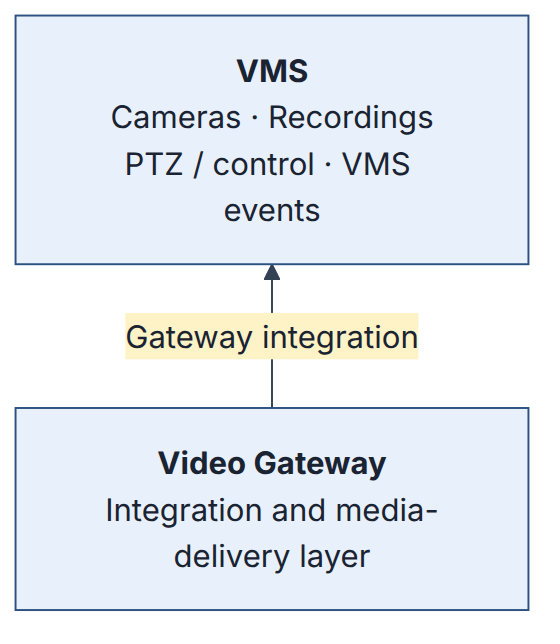
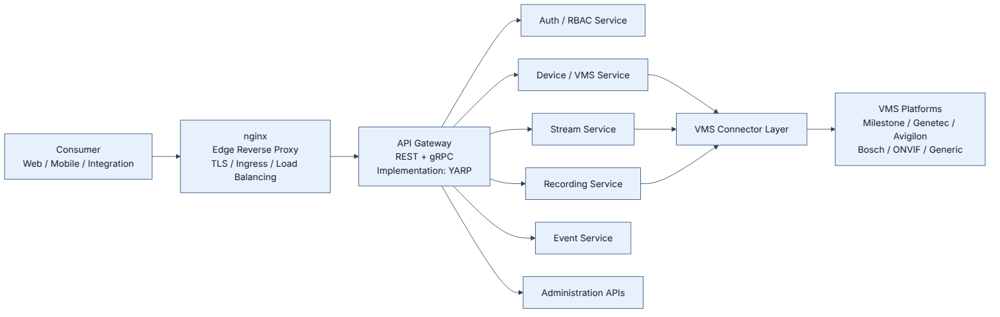
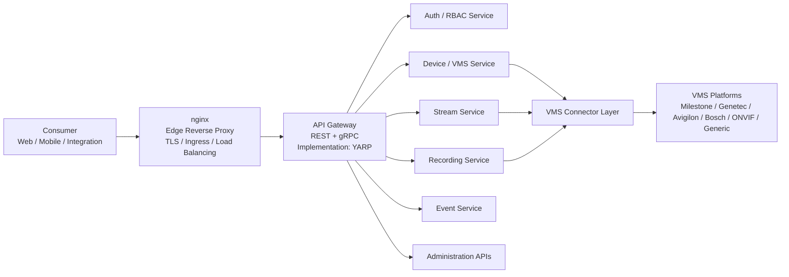
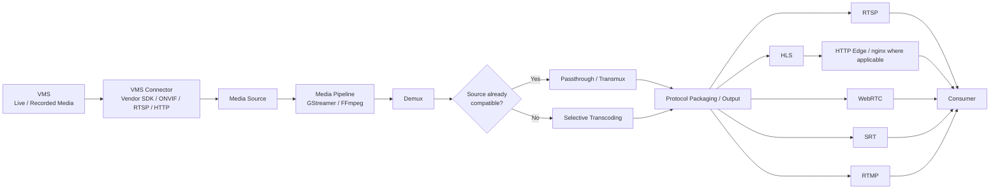
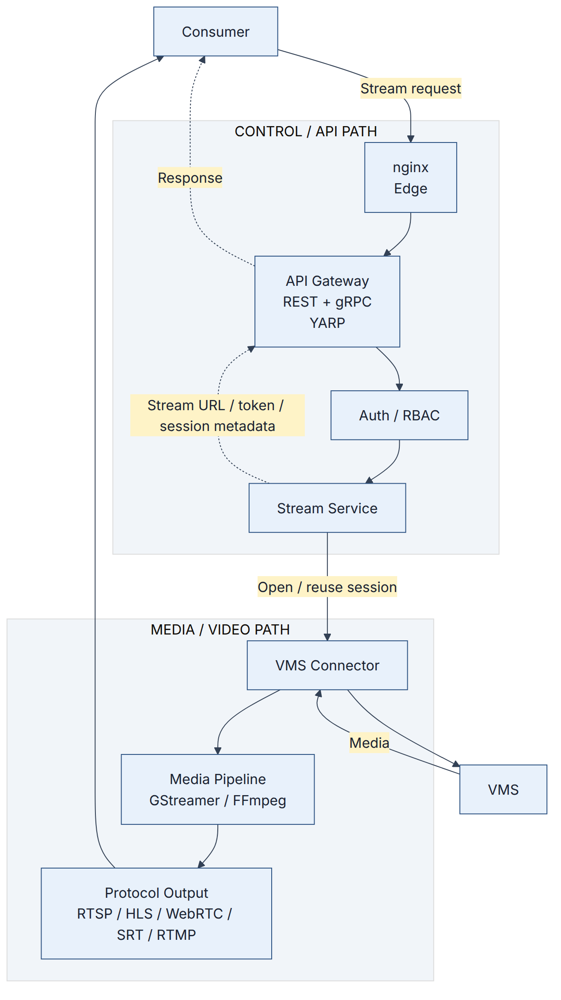
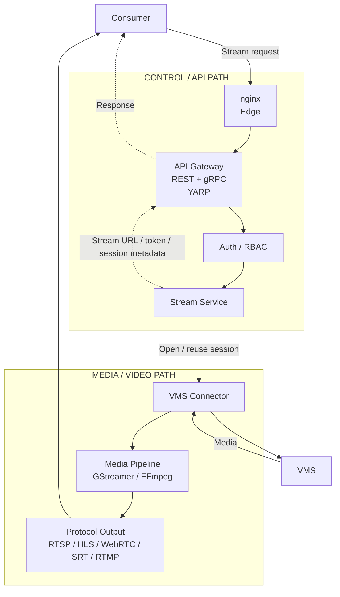
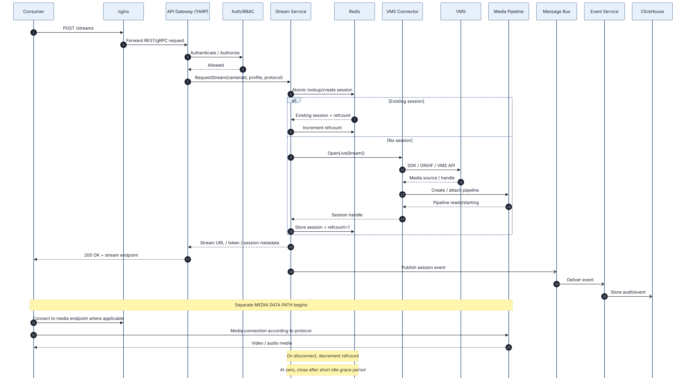
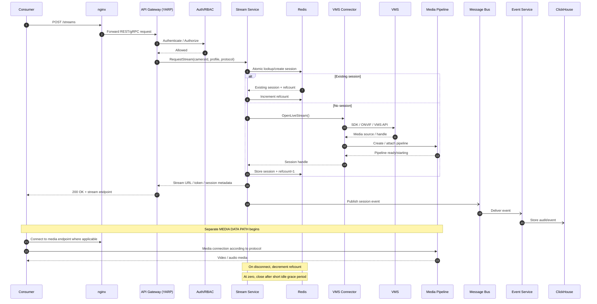

# Video Gateway — High-Level Design (HLD)

| | |
| --- | --- |
| **Document Type** | Technical Architecture / Interview Response |
| **Status** | Submission Draft |
| **Version** | 2.0 |
| **Date** | August 2026 |

---

## 1. Purpose

This document presents a production-oriented high-level design for the Video Gateway described in the project brief.

The gateway is a back-end product that connects to third-party Video Management Systems (VMS), obtains live and recorded video, camera-control capabilities, and events, and exposes them through a common gateway interface and modern streaming protocols.

The gateway is **not** a replacement for a VMS. The VMS remains the source of truth for cameras, recordings and operator workflows. The gateway provides the integration and media-delivery layer between VMS platforms and consumers.

The architecture is deliberately divided into:

- **Edge / Control Communication Path** — HTTP/REST/gRPC requests, authentication, authorization, administration and control operations.
- **Video / Media Data Path** — actual video acquisition, media processing and protocol delivery.
- **Asynchronous Event Path** — events and audit messages through a message bus.

This separation is important because video data has very different performance and lifecycle characteristics from normal API traffic.

---

## 2. Scope and Requirements Alignment

The project brief requires the gateway to:

- Connect to multiple VMS systems through vendor SDKs, ONVIF or generic stream APIs.
- Keep the VMS as the source of truth and never connect directly to cameras.
- Discover cameras and provide a unified inventory.
- Deliver live video.
- Proxy recorded playback and support time-range requests, seeking and clip generation.
- Optionally archive selected streams on the gateway.
- Pass through PTZ, presets, tours, focus and iris controls through the VMS.
- Subscribe to motion, alarm, tamper and analytics events.
- Provide a substantial administration surface.
- Support Milestone XProtect, Genetec Security Center, Avigilon, Bosch BVMS, ONVIF-compatible systems and generic RTSP/HTTP systems.
- Produce RTSP, HLS, WebRTC, SRT and RTMP outputs.
- Avoid transcoding when the source is already compatible.
- Provide multi-tenant access control, auditing, observability and production operations.

The proposed architecture addresses these requirements while keeping VMS-specific SDK dependencies isolated behind adapters.

---

## 3. Architectural Principles

### 3.1 VMS remains the source of truth

The gateway does not replace the VMS and does not directly manage cameras.

The gateway reads and controls capabilities exposed by the VMS.

### 3.2 Control plane and media plane are separate

Normal API/control traffic and video bytes must not be treated as the same workload.

The **control plane** handles:

- Authentication
- Authorization
- Camera discovery
- VMS management
- Stream session creation
- Recording requests
- PTZ commands
- Configuration
- Administration
- Audit/event coordination

The **media plane** handles:

- Media acquisition
- Demuxing
- Transmuxing/repackaging
- Selective transcoding
- Segmentation
- Protocol-specific media output
- Long-running media sessions

The message bus is **not** part of the media data path.

### 3.3 nginx is an edge component, not the media engine

nginx is used as the edge reverse proxy / ingress component.

Its responsibilities may include:

- TLS termination
- External ingress
- HTTP routing
- Connection handling
- Edge-level load balancing
- Infrastructure-level policies

nginx is **not** responsible for:

- Video decoding
- Video encoding
- Transcoding
- Demuxing
- Media pipeline orchestration
- Codec conversion

Normal nginx reverse-proxy behavior should not be assumed to mean that every streaming protocol is proxied through nginx.

For HTTP-based media delivery such as HLS, nginx may participate in the delivery/routing path when appropriate.

For RTSP, SRT, RTMP or WebRTC media transport, the deployment must explicitly support the required protocol and connection model. The media engine remains responsible for media processing.

### 3.4 API Gateway is an architectural role; YARP is the implementation

The architecture uses an API Gateway as the application-level gateway.

Proposed implementation:

- **Architectural role:** API Gateway — REST + gRPC
- **Implementation:** YARP (Yet Another Reverse Proxy)

YARP is a .NET reverse-proxy toolkit that can implement application/API gateway responsibilities.

This is intentionally different from nginx:

| Component | Role |
| --- | --- |
| **nginx** | Infrastructure / edge proxy |
| **API Gateway (YARP)** | Application / API routing layer |

The architecture does not require YARP to process video bytes.

---

## 4. High-Level Architecture

The architecture is best represented with separate diagrams rather than placing nginx, YARP and the media engine into one ambiguous flow.

---

## 5. Diagram 1 — Edge and Control Communication Path

**Purpose:** HTTP/REST/gRPC and control communication. This diagram does **not** represent the actual video-byte path.

### Diagram interpretation

1. Consumer sends an API/control request.
2. nginx receives the external connection.
3. nginx performs edge-level responsibilities and forwards the API request.
4. The API Gateway provides application-level routing.
5. YARP is the proposed implementation of the API Gateway.
6. Authentication and authorization are applied before protected operations proceed.
7. Application services perform business operations.
8. VMS connectors translate gateway contracts into vendor-specific VMS operations.
9. The VMS remains the source of truth.

### Important boundary

No video stream should be assumed to flow through the API Gateway.

The API Gateway returns metadata such as:

- stream URL
- stream token
- session ID
- playback handle
- operation result

The actual media transfer follows the separate media path.

---

## 6. Diagram 2 — Video / Media Data Path

**Purpose:** the actual video path.

### Critical architecture statement

The **Media Pipeline** is the media-processing component. nginx is **not** the media engine.

The gateway should use passthrough or repackaging whenever the source is compatible with the requested output. Transcoding should only occur when required by codec, container, profile or protocol constraints.

---

## 7. Protocol-Specific Edge Considerations

The output protocols have different connection and delivery characteristics.

| Protocol | Typical purpose | nginx position |
| --- | --- | --- |
| **RTSP** | NVRs, players, integrations | Do not assume normal HTTP reverse proxying; use a protocol-capable media endpoint. |
| **HLS** | Browser/mobile/CDN distribution | nginx can participate as HTTP edge/proxy/static segment delivery where appropriate. |
| **WebRTC** | Low-latency interactive monitoring | nginx can handle HTTP/signaling edge traffic where applicable; real-time media transport is handled separately. |
| **SRT** | Long-distance resilient contribution | Use a protocol-capable media endpoint; do not assume standard nginx HTTP proxy behavior. |
| **RTMP** | Legacy ingest/external CDN | Requires appropriate protocol support; do not represent generic nginx HTTP proxying as RTMP media handling. |

This prevents the architecture diagram from making the incorrect implication that nginx automatically proxies every media protocol.

---

## 8. Diagram 3 — Relationship Between Control Plane and Media Plane

The two paths are connected by session/control metadata, not by sending the video through the control services.

### Key point

The control path establishes and authorizes the media session.

The media path then carries the actual video.

---

## 9. Diagram 4 — Live Stream Request Sequence

This sequence shows the relationship between API/control and media delivery.

