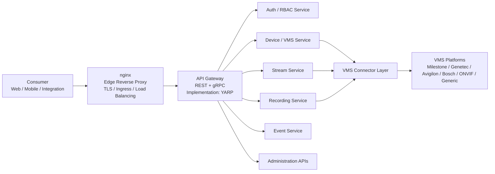

# Architecture Diagram Interpretation

This document interprets the left-to-right (LR) system flowchart for a video-platform integration stack. The diagram describes a **layered, gateway-mediated microservice architecture** that fronts multiple Video Management System (VMS) vendors behind a single consumer-facing API.

## What the diagram is saying

Traffic always enters from the left (clients) and moves right toward vendor systems. Each column is a **trust and responsibility boundary**:

| Column | Role |
| --- | --- |
| Consumer | Who calls the product |
| nginx | Public edge: TLS, ingress, load balancing |
| YARP API Gateway | Application routing: REST + gRPC, service discovery |
| Domain services | Product capabilities (auth, devices, streams, recordings, events, admin) |
| Connector layer | Vendor-neutral adapter |
| VMS platforms | External camera / recording systems |

The important structural claim is **not** that every service talks to every VMS. Only **Device**, **Stream**, and **Recording** go through the connector. Auth, Event, and Administration stay inside the product boundary.

---

## Layer-by-layer

### 1. Consumer — Web / Mobile / Integration

Three client classes share one ingress path:

- **Web** — operator consoles, live view, playback, configuration UIs.
- **Mobile** — field operators; typically fewer admin surfaces, more live/playback/events.
- **Integration** — third-party systems (PSIM, access control, analytics, custom backends) using the same public API.

They do **not** talk to domain services or VMS vendors directly. That keeps clients vendor-agnostic and lets TLS, auth, versioning, and rate limits live in one place.

### 2. nginx — edge reverse proxy

nginx is the **internet-facing** hop:

- Terminate TLS.
- Ingress routing (host/path, maybe geo or environment).
- Load balancing across gateway instances.
- Coarse filters: request size, connection limits, WAF-style rules, HTTP/2 or HTTP/3 to clients.

It is deliberately **not** the application gateway. nginx should stay protocol- and ops-oriented so it can sit in Kubernetes ingress, a VM, or a cloud load balancer without knowing service names or gRPC method maps.

### 3. API Gateway (YARP) — REST + gRPC

[YARP](https://github.com/dotnet/yarp) (Yet Another Reverse Proxy) is the **.NET application gateway**. After nginx, it owns:

- Path / cluster routing to Auth, Device, Stream, Recording, Event, Admin.
- Dual protocols: **REST** for CRUD and integrations; **gRPC** for streaming, events, and low-latency internal-style calls from first-party apps.
- Cross-cutting API concerns: correlation IDs, auth token forwarding, retries/timeouts, proto/JSON transcoding if used.

Split with nginx:

| Concern | nginx | YARP |
| --- | --- | --- |
| TLS / certificates | Yes | Usually no (internal HTTP/2 or mTLS) |
| Public load balancing | Yes | Horizontal scale of gateway pods |
| Route to *services* | No | Yes |
| REST + gRPC policy | Limited | Yes |

### 4. Domain services (behind the gateway)

Six capabilities sit **side by side**. The gateway fans out; services do not form a chain with each other on this diagram.

| Service | Responsibility | Talks to VMS? |
| --- | --- | --- |
| **Auth / RBAC** | Identity, tokens, roles, permissions | No |
| **Device / VMS** | Cameras, sites, NVR/VMS inventory, health, capabilities | Yes |
| **Stream** | Live video (RTSP/WebRTC/HLS/etc. as implemented) | Yes |
| **Recording** | Playback, export, retention metadata | Yes |
| **Event** | Alarms, motion, analytics, audit-style notifications | No (on this diagram) |
| **Administration APIs** | Tenants, users, system config, licensing | No |

**Auth / RBAC** is a peer of the other services, not a sidecar drawn on every arrow. In practice the gateway (or each service) still **calls Auth** to validate tokens and enforce RBAC. The diagram shows Auth as a **routable product API** (login, token refresh, role admin) as well as the authorization source of truth.

**Event** and **Administration** not pointing at the connector means:

- Events may be ingested another way (webhooks, message bus, a connector path not drawn), or they are **product-native** (audit, user actions, health) rather than vendor alarm streams.
- Administration is **your** control plane (tenants, users, feature flags), not Milestone/Genetec admin consoles.

If vendor alarms must be first-class later, Event would typically grow a connector dependency or consume a bus that the connector publishes to. The current picture keeps Event inside the platform.

### 5. VMS Connector Layer

This is the **anti-corruption / adapter** layer. Device, Stream, and Recording depend on connectors, not on Milestone or Genetec SDKs directly.

Typical jobs:

- Map product models (camera id, stream URI, recording window) onto vendor APIs.
- Hide SDK differences: Milestone XProtect, Genetec Security Center, Avigilon, Bosch, ONVIF, and a generic fallback.
- Connection pooling, session/login to each VMS, retries, and vendor error translation.
- Optional protocol bridging (ONVIF vs proprietary).

**Device / Stream / Recording all share CONN** so one camera identity and one vendor session model can serve inventory, live, and playback. Without that, each service would reimplement login and site topology.

The connector is **not** a public API. Consumers never address it; only the three media/device services do.

### 6. VMS platforms

External systems of record for cameras and video:

- **Milestone, Genetec, Avigilon, Bosch** — commercial VMS products with their own SDKs and auth.
- **ONVIF** — standards-based devices/NVRs when a full VMS is not in the path.
- **Generic** — catch-all (RTSP-only cameras, custom NVRs, mocked/lab backends).

These sit **outside** the product. Availability, firmware, and recording retention are vendor concerns; the connector must degrade when a VMS is down.

---

## Request flows (how to read the arrows)

### Authenticated API call (typical REST)

1. Browser / app / integrator → **nginx** (TLS).
2. nginx → **YARP**.
3. YARP authenticates or forwards the token; routes by path (e.g. `/devices`, `/streams`).
4. Target service executes; if it is Device, Stream, or Recording, it calls **CONN**.
5. CONN talks to the correct **VMS** implementation.
6. Response returns along the same path.

### Live stream

Same ingress, then **Stream Service → Connector → VMS**. Media may after that bypass JSON (WebRTC/HLS/RTSP proxy). The diagram only shows **control-plane** routing; media plane can still terminate at Stream or a dedicated media proxy behind the same gateway.

### Playback / export

**Recording Service → Connector → VMS**. Time ranges, codecs, and export formats are translated in CONN.

### Login / permission change

**Consumer → nginx → YARP → Auth / RBAC**. No VMS hop. Device/Stream/Recording later enforce those permissions on each call.

### Admin configuration

**Consumer → … → Administration APIs**. Platform config only, unless a future design uses Admin to provision connector credentials (still not drawn as a VMS arrow).

---

## Design implications

**Single front door.** All client types share nginx + YARP. Versioning, mTLS to services, and rate limits belong here, not in each VMS SDK.

**Two proxy hops are intentional.** Edge (nginx) vs application routing (YARP) matches common Kubernetes + .NET layouts: Ingress/nginx in front of a YARP deployment.

**Vendor isolation.** Replacing Avigilon or adding ONVIF is a connector change, not a Web/Mobile change.

**Partial VMS coupling.** Auth, Event, and Admin can scale, deploy, and fail independently of vendor SDKs. Device/Stream/Recording share fate with connector and VMS availability.

**Protocol duality.** REST + gRPC at the gateway implies first-party clients may use gRPC (streams, events) while integrators keep REST.

---

## What the diagram does not show (gaps to be explicit about)

These are omitted, not disproven:

- Databases, caches, and object storage (recordings, thumbnails).
- Async messaging (events from VMS → Event Service).
- Service-to-service calls (Stream → Device for camera lookup; Recording → Auth for fine-grained checks) besides gateway routing.
- Media plane vs control plane (RTP/WebRTC ports).
- Multi-tenancy and which VMS a tenant is bound to (likely Device + Connector + Admin).
- Observability (tracing from nginx through YARP into CONN).

The Event Service having **no** connector arrow is the largest functional ambiguity: vendor alarms either arrive out of band or are not in v1 of this view.

---

## Summary

The architecture is a **BFF-less, gateway-centric VMS facade**:

- Clients hit **nginx**, then **YARP**.
- YARP dispatches to six domain services.
- **Device, Stream, and Recording** are the only services that reach cameras and NVRs, and they do so only through a **shared VMS Connector Layer**.
- That connector is the sole translation point for **Milestone, Genetec, Avigilon, Bosch, ONVIF, and generic** backends.

Read left-to-right as **exposure → routing → capability → adaptation → vendor**. Read the missing arrows as **intentional isolation**: identity, events (as drawn), and administration do not depend on VMS SDKs.
